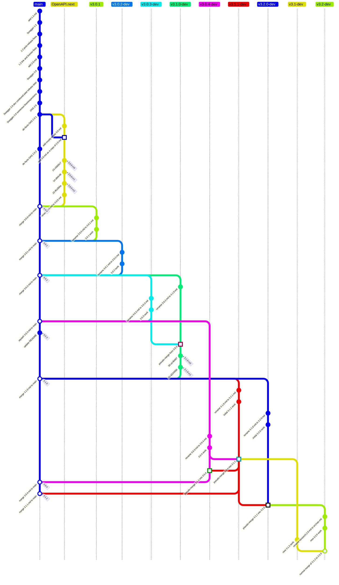

# Contributing to the OpenAPI Specification

***Work in progress!**  Each section links to issues that are relevant to fill out the rest of this document.*

We are currently working on [defining and documenting our new processes](https://github.com/orgs/OAI/projects/5).  Information in this document is up-to-date.  Older _(and sometimes now inaccurate)_ documentation can be found in [DEVELOPMENT.md](DEVELOPMENT.md), which will be removed when everything is updated and documented here.

## Essential Policies

This section serves as a quick guide while we work on the full updated documentation.

If in doubt about a policy, please [ask on our Slack](https://communityinviter.com/apps/open-api/openapi) before opening a PR.

### No changes to published specifications

No changes, ***no matter how trivial***, are ever made to the contents of published specifications.  The only potential changes to those documents are updates to link URLs _if and only if_ the targeted document is moved by a 3rd party.  Other changes to link URLs are not allowed.

### Development and publication process

Specifications and schemas are published to the [spec site](https://spec.opanapis.org) from the `main` branch:

* Specifications are published from the `versions/` directory
* Schemas are published from the `schemas/` directory

Specification development occurs on branches derived from the `dev` branch, which contains the `src` directory and the `src/oas.md` file:

* Releases are deveoped on _minor release line branches_: `vX.Y-dev`
* Post-release fixes are done on _patch release fix branches_: `vX.Y.Z-fix`

When a specification is ready for publication, the `src/oas.md` file from that branch is tagged and copied to `versions/X.Y.Z.md`, which triggers an automatic PR to the spec site.

Development of schemas [currently occurs on `main`](#changing-the-schemas), but the process is [being re-evaluated and is likely to change](https://github.com/OAI/OpenAPI-Specification/issues/3715).

#### Branch Diagram
```
2011-08-10      Swagger 1.0
2012-08-22      Swagger 1.1
2014-04-11  5d3a0e90d5bfac492ad323ce4ddc4b9f448fb1f1 branch 1.2-fix
2014-04-13      Swagger 1.2
    v1.2-fix
        2015-06-04  1e1b03b8aa6995dd660b510ebd1b0284057722eb HEAD
2014-09-08  1ad099b1b7a5e187f431f4abc5358a70c3fad2bf last commit on release day
2014-09-08      Swagger 2.0
2014-10-05  dc8166dd90fe498ceec8af58f6a943dc8f5b2db7 spec settles
2014-11-17  91ed265e6daf6baf439ed74f8f13070a976ddff4 Oct-Nov fixes
2015-11-21  b9476ee239b1eac27717e39ff5ad39092f8d79df last Swagger 2.0 rev
2015-10-30  b9476ee239b1eac27717e39ff5ad39092f8d79df branch 2.0-fix
2015-12-31      OAS 2.0
    v2.0-fix
        2.0 2016-01-29  b9476ee239b1eac27717e39ff5ad39092f8d79df fix typo (3.0 br)
    v3.0-dev
        2.0 2016-09-29  fb50e3f7f07d0049cfa8c094143154f73405408e Jul-Sep fixes
2017-02-28  d232e6d3e1ea4038a533329a82876ae868e9cf13
2017-02-28      OAS 3.0.0-rc0
        2.0 2017-04-04  fb059ca461bd17b10a9e3e59879f04485886d356 Jan-Apr fixesjk
2017-04-27  0686522d8bf6aa81ab84070a3af498d083d08d8b
2017-04-27      OAS 3.0.0-rc1
2017-06-16  9c083382b39148f909b9dce768740f43e4a61a66
2017-06-16      OAS 3.0.0-rc2
        2.0 2023-10-19  78170608af208da8165ab095715e5cb9ff715f47 IETF link fix
        2.0 2024-02-13  7cc8f4c4e742a20687fa65ace54ed32fcb8c6df0 MD link fix
2017-07-26  e9c539d86f080f133aa35c3e7db33ef004496625
2017-07-26      OAS 3.0.0
    v3.0-fix
        300 2023-10-19 78170608af208da8165ab095715e5cb9ff715f47 IETF link fix
        300 2024-02-13 7cc8f4c4e742a20687fa65ace54ed32fcb8c6df0 MD link fix
2017-12-06      OAS 3.0.1
2018-10-08      OAS 3.0.2
2020-02-20      OAS 3.0.3
2020-06-18      OAS 3.1.0-rc0
2020-10-08      OAS 3.1.0-rc1
2021-02-15      OAS 3.1.0
```
```markdown
OK, having spent more time with it now that I've figured out some key things, I think I understand how this was supposed to work.

## The original intent

**Basically, it was designed for a workflow in which there were never multiple release lines.**

If you never have parallel releases, it's fine to rename a file across each new branch because the actual development is (conceptually) _linear_, and the branch/file changes are just organizing the conceptual line and ensuring that the published spec is under the correct name.

This explains why asking for a 3.0.4 was seen as... if not strange, then at least something that was not entirely in the plan.  Actually, IIRC, deciding to do a 3.0.3 after having started 3.1.0 was mildly controversial.  In the diagram below, you'll see that that's where the first "pseudo-merge" occurred.

## Pseudo-merges

A "pseudo-merge" (a term I just made up) is a porting of commits from one file on one branch to another file on a different branch.  _This is what we want to eliminate, because it is not well-supported by_ `git` (it requires creative use of `git format-patch` and `git am` which are not commands most people even know exist).

In the diagram below, I have _not_ made square commits for all of the porting between 3.0.4, 3.1.1, and 3.2.0, because that would be a dizzying mess of arrows in all directions.  Instead, I've just treated it as if each release forward-pseudo-merged to the next one as it was released, which is close enough in concept.

## Simplified visual

All filenames not prefixed by a directory are under `versions/`

Square outlines are "pseudo-merges" (treating 3.0.4 -> 3.1.1 and 3.1.1 -> 3.2.0 as having one pseudo-merge each at the end of the earlier-numbered release, instead of the extremely complicated reality).

Circular outlines are normal merges.

```

```
OK, having spent more time with it now that I've figured out some key things, I think I understand how this was supposed to work.
#### Current branches open to change

The first PR for a change should be against the oldest release line to which it applies.  Changes can then be forward-ported as appropriate.

The specification under development is `src/oas.md`, which _only_ exists on development branches, not on `main`.

The current (20 October 2024) active specification releases are:

| Version | Branch | Notes |
| ------- | ------ | ----- |
| 3.1.2 | `v3.1-dev` | |
| 3.2.0 | `v3.2-dev` | |
| 4.0.0 | [OAI/sig-moonwalk](https://github.com/OAI/sig-moonwalk) | [discussions only](https://github.com/OAI/sig-moonwalk/discussions) |

#### Changing the schemas

Schemas are only changed _after_ the specification is changed.
Changes are made to the YAML versions on the `main` branch.
The JSON versions are generated when publised to the spec site, at which time the `WORK-IN-PROGRESS` URI placeholders are replaced with the publication date.

## Authoritative source of truth

The [spec site](https://spec.openapis.org) is the source of truth.

This changed in 2024, as the markdown files on `main` do not include certain credits and citations.

## Style Guide

Contributions to this repository should follow the style guide as described in this section.

### Markdown

Markdown files in this project should follow the style enforced by the [markdownlint tool](https://www.npmjs.com/package/markdownlint),
as configured by the `.markdownlint.json` file in the root of the project.

The following additional rules should be followed but currently are not enforced by tooling:

1. The first mention of a normative reference or an OAS-defined Object in a (sub)*section is a link, additional mentions are not
2. OAS-defined Foo Bar Objects are written in this style, and are not monospaced
3. "example" instead of "sample" - this spec is not about statistics
4. Use "OpenAPI Object" instead of "root"
5. Fixed fields are monospaced
6. Field values are monospaced in JSON notation: `true`, `false`, `null`, `"header"` (with double-quotes around string values), ...
7. A combination of fixed field name with example value uses JS notation: `in: "header"`, combining rules 5 and 6
8. An exception to 5-7 is colloquial use, for example "values of type `array` or `object`" - "type" is not monospaced, so the monospaced values aren't enclosed in double quotes.
9. Use Oxford commas, avoid Shatner commas.
10. Use `<span id="thing"></span>` for link anchors. The `<a name="thing"></a>` format has been deprecated.

### Use of "keyword", "field", "property", and "attribute"

* JSON Schema keywords -> "keyword"
* OpenAPI fixed fields -> "field"
* property of a "plain" JSON object that is not an OpenAPI-defined Foo Object -> "property"
* "attribute" is only used in the XML context and means "XML attribute"

## Release Process and Scope

* Issue #3528: [3.x.y patch release approach](https://github.com/OAI/OpenAPI-Specification/issues/3528)
* Issue #3529: [3.x minor release approach](https://github.com/OAI/OpenAPI-Specification/issues/3529)
* Issue #3715: [Define and document our schema publishing process](https://github.com/OAI/OpenAPI-Specification/issues/3715)
* Issue #3785: [Style guide / release checklist for the specification](https://github.com/OAI/OpenAPI-Specification/issues/3785)

## Branching and Versioning

* Issue #3677: [Define and document branch strategy for the spec, both development and publishing](https://github.com/OAI/OpenAPI-Specification/issues/3677)

## Proposals for Specification Changes

As an organisation, we're open to changes, and these can be proposed by anyone.
The specification is very widely adopted, and there is an appropriately high bar for wide appeal and due scrutiny as a result.
We do not accept changes lightly (but we will consider any that we can).

Small changes are welcome as pull requests.

Bigger changes require a more formal process.

1. Start a [discussion](https://github.com/OAI/OpenAPI-Specification/discussions) of type "Enhancements".
   The discussion entry must include some use cases, your proposed solution and the alternatives you have considered.
   If there is engagement and support for the proposal over time, then it can be considered as a candidate to move to the next stage.

2. It really helps to see the proposed change in action.
   Start using it as a `x-*` extension if that's appropriate, or try to bring other evidence of your proposed solution being adopted.

3. If you are adding support for something from another specification (such as OAuth), please point to implementations of that
   specification so that we can understand how, and to what degree, it is being used.

4. If the suggested change has good support, you will be asked to create a formal proposal.
   Use the [template in the proposals directory](https://github.com/OAI/OpenAPI-Specification/tree/main/proposals), copy it to a new file, and complete it.
   Once you the document is ready, open a pull request on the main branch.

5. The proposal will be more closely reviewed and commented on or amended until it is either rejected or accepted.
   At that point, the proposal is merged into the `main` branch and a pull request is opened to add the feature to the appropriate `dev` version of the specification.

Questions are welcome on the process at any time. Use the discussions feature or find us in Slack.

## Working in GitHub

* Issue #3847: [Document milestone usage in DEVELOPMENT.md](https://github.com/OAI/OpenAPI-Specification/issues/3847)
* Issue #3848: [Define and add new process labels and document general label usage in DEVELOPMENT.md](https://github.com/OAI/OpenAPI-Specification/issues/3848)

### Roles and Permissions

* Issue #3582: [TOB info needs to be updated](https://github.com/OAI/OpenAPI-Specification/issues/3482)
* Issue #3523: [Define triage role criteria and process](https://github.com/OAI/OpenAPI-Specification/issues/3523)
* Issue #3524: [Define the maintainer role criteria and process](https://github.com/OAI/OpenAPI-Specification/issues/3524)

### Projects

The OpenAPI Initiative uses GitHub Projects to manage work _outside_ of the specification development process.  There are currently two active projects:

* [Contributor Guidance](https://github.com/orgs/OAI/projects/5/views/1)
* [Automation & Infrastructure](https://github.com/orgs/OAI/projects/4/views/1)

### Discussions

We are beginning (as of mid-2024) to use GitHub [discussions](https://github.com/OAI/OpenAPI-Specification/discussions?discussions_q=is%3Aopen) for open-ended topics such as major enhancements.

* Issue #3518: [Define criteria for filing/closing issues vs discussions](https://github.com/OAI/OpenAPI-Specification/issues/3518)

### Issues

As of mid-2024, we prefer to use issues for topics that have a clear associated action.  However, many existing issues are more open-ended, as they predate GitHub's discussions features.

* Issue #3518: [Define criteria for filing/closing issues vs discussions](https://github.com/OAI/OpenAPI-Specification/issues/3518)

### Automated closure of issues Process

In an effort to keep the list of issues up to date and easier to navigate through, issues get closed automatically when they become inactive.

This process makes use of the following labels:

* `Needs author feedback`: the issue has been replied to by the triage team and is awaiting a follow up from the issue's author. This label needs to be added manually by people doing triage/experts whenever they reply. It's removed automatically by the workflow.
* `No recent activity`: the issue hasn't received a reply from its author within the last 10 days since `Needs author feedback` was added and will be closed within 28 days if the author doesn't follow up. This label is added/removed automatically by the workflow.
* `Needs attention`: The issue's author has replied since the `Needs author feedback` label was set and the triage team will reply as soon as possible. This label needs to be removed manually by people doing triage/experts whenever they reply. It's added automatically by the workflow.

### Automated TDC agenda issues Process

An issue is opened every week, 7 days in advance, for the Technical Developer Community (TDC), it provides the information to connect the meeting, and serves as a placeholder to build the agenda for the meeting. Anyone is welcome to attend the meeting, or to add items to the agenda as long as they plan on attending to present the item. These issues are also automatically pinned for visibility and labeled with "Housekeeping".

Ten (10) days after the meeting date is passed (date in the title of the issue), it gets closed and unpinned automatically.

## Pull Requests

* Issue #3581: [Who and how many people need to sign-off on a PR, exactly?](https://github.com/OAI/OpenAPI-Specification/issues/3581)
* Issue #3802: [Define a policy using draft PRs when waiting on specific approvals](https://github.com/OAI/OpenAPI-Specification/issues/3802)

## Updating the Registries

* Issue #3598: [Minimum criteria for Namespace Registry](https://github.com/OAI/OpenAPI-Specification/issues/3598)
* Issue #3899: [Expert review criteria for registries (How exactly does x-twitter work?)](https://github.com/OAI/OpenAPI-Specification/issues/3899)
